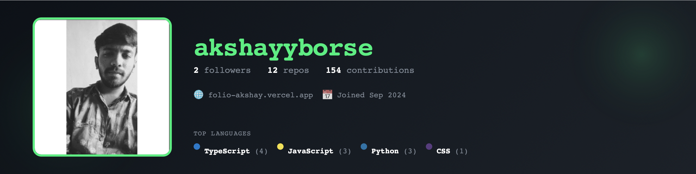

<!-- Profile Banner -->

  

# Hi there 👋  
**I’m Akshay Borse**  
Frontend Engineer | Crafting AI-powered web & UI experiences  

---

## 🚀 About Me  
- Passionate about building intuitive, high-performance web apps using modern frontend technologies.  
- Constantly exploring how AI and machine learning can enhance UIs and user experiences.  
- Lover of clean design, meaningful animations, and subtle micro-interactions.  
- Based in Surat, Gujarat, India — open to collaborate remotely or locally.

---

## 💻 Tech Stack  
**Frontend:** HTML5, CSS3, JavaScript (ES6+), TypeScript  
**Frameworks/Libraries:** React, Next.js, Tailwind CSS, styled-components  
**Tools:** Git, GitHub, VS Code, Webpack / Vite, CI/CD pipelines  
**Other Interests:** AI integration in frontend, accessibility, performance optimisation, UI/UX best practices  

---

## 📂 Featured Projects  
- 🎨 [**Folio-Akshay**](https://github.com/akshayyborse/Folio-Akshay) — My personal portfolio site (React + TypeScript)  
- ✏️ [**Custom-Font-Editor**](https://github.com/akshayyborse/custom-font-editor) — Tool for designing and editing fonts/images  
- 🔗 [**URL Shortener**](https://github.com/akshayyborse/urlshortner) — Minimal CSS-based short link interface  
- 💰 [**Finance Tracker**](https://github.com/akshayyborse/Finanace-tracker) — Python-based app for expense management  

---

## 🌱 What I’m Learning  
- Building intelligent UIs using AI APIs (OpenAI, Gemini, LangChain, etc.)  
- Backend foundations: Node.js, Express, MongoDB  
- Advanced design systems and component libraries  

---

## 📊 GitHub Stats  

  
  

---

## 🤝 Let’s Connect  

  
  
  
  

---

⭐️ _Thanks for visiting! Feel free to explore my repositories and reach out for collaborations._ ✨
